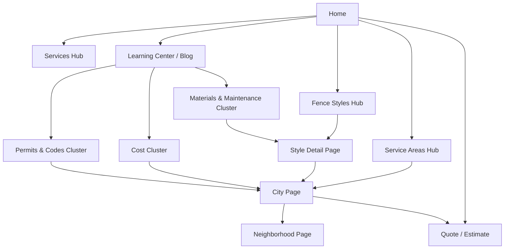
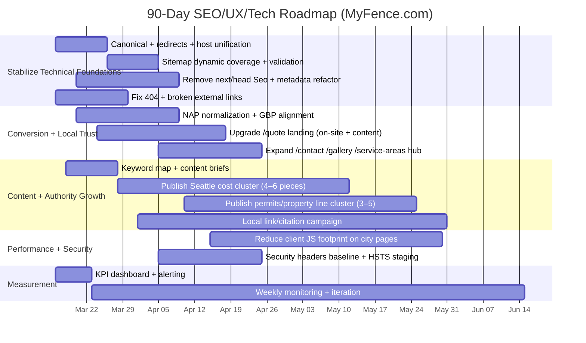

# SEO/UX/Technical Strategy Guide to Improve MyFence and Outrank coolcatfence.com

## Executive summary

### Connector inventory and scope
Enabled connectors discovered via `api_tool.list_resources` and used in this audit:
- GitHub
- Semrush

Scope constraints honored:
- Code audit used **only** the GitHub repo `christopher0331/myfence-clone`.
- Competitive intelligence used Semrush domain + project data for **myfence.com** and **coolcatfence.com** (both present as Semrush Projects).
- Additional best‑practice guidance is grounded primarily in Google Search Central / Search Console / official platform documentation and similar primary sources.

### Site domain and other inputs
- **Detected site domain:** `myfence.com` (from `src/constants/siteConfig.ts`) fileciteturn6file0L1-L40  
- **Hosting/deployment:** Netlify configuration exists (`netlify.toml`) fileciteturn14file0L1-L34  
- **Key unspecified / not directly verifiable here**
  - Confirm whether **myfence.com is the live production domain** for this repo (repo says yes; you may also have staging domains).
  - Google Search Console access level, GA4 access, call tracking system, CRM, and lead attribution model (not accessible via connectors here).
  - Your “outrank” definition (e.g., local pack in Seattle vs informational national keywords). I assume: **beat Cool Cat on high‑intent Seattle/King County fencing queries** while also expanding TOFU content.

### Competitive baseline (Semrush snapshot)

**Organic footprint (US database)**
- myfence.com: **97 organic keywords**, **~23 estimated organic visits**, $17 estimated traffic cost; **0 paid keywords**.  
- coolcatfence.com: **16,434 organic keywords**, **~15,952 estimated organic visits**, $40,230 estimated traffic cost; **42 paid keywords**.  
(From Semrush Domain Rank report.)  

**Traffic & keyword trend (Semrush historical)**
- coolcatfence.com shows sharp growth into 2026‑02 (e.g., 11,684 → 17,752 keywords; 10,733 → 20,809 organic traffic from 2026‑01 to 2026‑02).  
- myfence.com remains small but improving (e.g., 86 → 94 keywords; 28 → 23 traffic from 2026‑01 to 2026‑02).  

**Backlink profile (Semrush Backlink Analytics)**
- myfence.com: **2,048 backlinks**, **1,462 referring domains**, Authority Score **15**.  
- coolcatfence.com: **759 backlinks**, **215 referring domains**, Authority Score **24**.  
The quantity advantage on myfence.com is likely diluted by low‑quality sources (see “Backlink health”).  

**Site Audit (Semrush Projects)**
- myfence.com Site Audit Quality: **91**; 106 pages crawled; top issues include low text‑to‑HTML ratio, broken external links, and a 4xx URL.  
- coolcatfence.com Site Audit Quality: **84**; 193 pages crawled; top issues include incorrect sitemap URLs, structured data errors, disallowed internal resources, and universally low text‑to‑HTML ratio.

### Priority scorecard (issues → impact/effort → severity)

| Area | Issue | Evidence | Why it matters for outranking | Priority |
|---|---|---|---|---|
| Indexation & canonicals | **www vs non‑www indexing split** appears in Semrush Top Pages for myfence | Semrush “domain_organic_unique” shows `https://www.myfence.com/` as the only page with traffic, and a separate `https://myfence.com/` entry with 0 traffic | Splits signals, causes duplicate URLs, weakens authority consolidation; Google recommends stacking redirects + canonical + sitemap signals for canonicalization citeturn2search0 | High |
| SEO architecture | **Sitemap likely missing dynamic service‑area routes** because current generator skips dynamic segments | `src/app/sitemap.ts` explicitly skips dynamic segments like `[city]` fileciteturn10file0L1-L89 | Your primary moneypages are service areas; leaving them out weakens discovery & canonical hints (sitemap is a canonical hint and discovery mechanism) citeturn1search0turn2search0 | High |
| Content quality at scale | Many service‑area pages flagged for **low text‑to‑HTML ratio** | Semrush Site Audit issue 112 hits 92 pages, dominated by service‑areas and key pages citeturn0file0turn0file1turn0file2turn0file3turn0file5 | Signals “thin/templated” risk; also reduces long‑tail coverage and conversion trust. Google warns against scaled low‑value content and cloaking practices citeturn5search0 | High |
| Technical SEO | Pages/components rely on `next/head` via a custom `Seo` component in the App Router | `src/components/Seo.tsx` uses `next/head` fileciteturn63file0L1-L85 | In App Router, metadata should be implemented through the Metadata API (Server Components). Reduces risk of duplicated/incorrect head output; helps OG, canonical coherence citeturn1search6 | High |
| Local SEO trust | **NAP inconsistencies inside structured data** (Seattle vs Maple Valley; mixed ZIPs) | Quote page schema uses Seattle + `98101` while other code uses Maple Valley `98038` fileciteturn85file0L40-L118 fileciteturn86file0L1-L80 | Inconsistent business identity undermines local trust and can complicate GBP alignment; Google emphasizes accurate representation and precise address/service area citeturn3search2 | High |
| UX/Conversion | Quote tool is iframe/offsite for mobile; thin page content | `/quote` is low word count (81 words) per Site Audit issue 117 citeturn0file0turn0file1turn0file2turn0file3turn0file5 and relies on iframe/external domain in `QuoteToolPage` fileciteturn85file0L1-L170 | Conversion leakage + poor landing relevance; competitor runs paid to tailored landing pages; you need stronger “estimate” funnel pages to compete | High |
| Link quality | myfence.com has large volumes of **spammy anchors/domains** | Semrush anchors show foreign/error‑text anchors; ref domains include adult/spam sites | Raises manual‑action risk; disavow isn’t for routine use, but Google recommends it when you have many spammy links and risk/receive manual action citeturn11view0 | High |
| Hygiene | Broken external links across service‑area pages | Semrush issue 12 lists dozens of broken external links on service‑areas pages (404/DNS/429/530) | Degrades UX + can look “uncared for” at scale; also wastes crawl | Medium |
| On‑page | Titles too long on key pages | Semrush issue 102 (9 URLs) citeturn0file0turn0file1turn0file2turn0file3turn0file5 | SERP truncation/rewrite; less CTR control | Medium |
| Security headers | Need formal security header posture (HSTS, etc.) | Not confirmed in headers from tooling here; add as hardening baseline | HSTS reduces downgrade risk and improves security posture; must be deployed carefully (MDN guidance) citeturn4search1 | Medium |

## GitHub repo audit findings

### Current stack and deployment posture
- The repo is a Next.js app (`next@16.x`) with Netlify configuration present (`netlify.toml`) and Next configuration (`next.config.mjs`). fileciteturn3file0L1-L42 fileciteturn5file0L1-L66 fileciteturn14file0L1-L34  
- `public/robots.txt` exists and points to `https://myfence.com/sitemap.xml`. fileciteturn15file0L1-L8  
- A dynamic Next sitemap route handler exists (`src/app/sitemap.ts`) and constructs URLs from filesystem + MDX blog posts, but explicitly **skips dynamic segments**. fileciteturn10file0L1-L89

### Structural SEO and metadata implementation risks
Your repo is partially migrated from Vite/React to Next “App Router” (documented in `NEXT_MIGRATION.md`). fileciteturn8file0L1-L120  
However:

- A custom `Seo` component uses `next/head` even on App Router pages. fileciteturn63file0L1-L85  
  Next’s Metadata API is the canonical approach for SEO head tags in the App Router and is only supported in Server Components. citeturn1search6  
- Several pages *already* export `metadata`/`generateMetadata` **and** also render `<Seo />`, which risks duplicated meta tags or inconsistent canonical behavior.

### Service-area architecture and content “thinness” pattern
Your service area template is a **client component** and assembles a large UI with maps, reviews widgets, galleries, etc. fileciteturn86file0L1-L120  
This can still be indexable, but it raises practical SEO risks:

- **Text to HTML ratio** can drop when the page is dominated by UI scaffolding and scripts (Semrush confirms this at scale; see Site Audit section).  
- Multiple sections appear generic (“Our Services in {city}…”) and may not provide unique local expertise per city/neighborhood unless `articleContent`, `localChallenges`, etc. are actually populated in each city file.

### Structured data: strengths and critical compliance gaps
Strengths:
- Homepage uses `metadata` export with canonical and includes FAQ/LocalBusiness schema blocks. fileciteturn4file0L1-L200  
- Service area template includes advanced normalization logic for schema, including areaServed handling and filtering out unsupported services. fileciteturn86file0L80-L170

Critical gaps:
- **NAP identity inconsistencies** appear across schema definitions (Seattle `98101` vs Maple Valley `98038`), and multiple pages hardcode addresses rather than using a single normalized source of truth. fileciteturn85file0L40-L118 fileciteturn86file0L1-L80  
- **Self‑serving review markup**: your templates add `aggregateRating` and embed reviews widgets. Google explicitly states it will not show review rich results for self‑serving `LocalBusiness`/`Organization` review markup. citeturn6search2  
  Additionally, Google’s general structured data policies emphasize that markup must reflect visible content and not be misleading. citeturn2search2  
- Your homepage includes `aggregateRating` `reviewCount: 150` and service-area/quote pages include similar counts; unless these reviews are first‑party, verifiable, and visible on-page in a compliant manner, you should treat them as risk (at minimum: don’t rely on them for stars; at worst: if inaccurate, could be considered misleading). citeturn2search2turn6search2

### Redirect and migration posture
`netlify.toml` contains many explicit redirects, indicative of a migration from prior URL structures. fileciteturn14file0L35-L140  
Google recommends minimizing redirect chains and favors server-side 301/308 redirects for permanent moves. citeturn7search1turn7search0  
Action implication: you should validate **redirect coverage** (old → new) against Search Console crawl + 404s and ensure no chains/loops.

## Semrush competitive analysis: myfence.com vs coolcatfence.com

### Organic performance and “why they’re winning”
Semrush indicates coolcatfence.com’s organic footprint is orders of magnitude larger than myfence.com (16k+ keywords vs <100). Their top pages are classic “cost” and “how‑to” informational hubs that each rank for hundreds to thousands of keywords. This is visible in Semrush Top Pages, where single URLs (e.g., “privacy fence cost”) drive meaningful traffic share.

Interpretation: coolcatfence.com is competing in two layers simultaneously:
- **Local service queries** (Seattle/Portland “fence company” terms)
- **National/evergreen informational queries** (fence costs, staining, property line rules), feeding topical authority and links.

Your site today is primarily positioned as a local contractor site with early content.

### Site Audit comparison
Semrush project site audits show:

**myfence.com**
- Quality score 91; 106 pages crawled.
- Key issues: low text-to-HTML ratio (112), broken external links (12), 4xx errors (2), title too long (102), low word count (117).

**coolcatfence.com**
- Quality score 84; 193 pages crawled.
- Key issues: incorrect pages in sitemap (18), structured data markup errors (45), low text-to-HTML ratio (112) across all crawled pages, disallowed internal resources (130), robots missing sitemap reference (124), plus many notices on heading structure.

Competitive takeaway: **you already have a technical “quality” advantage**, but they win by **content depth + topical footprint + higher authority links**.

### Backlinks and anchor text: quality over quantity
myfence.com has far more referring domains (1,462 vs 215), but lower authority score (15 vs 24), suggesting much of the link profile is low value or risky.

Google’s spam policies explicitly call out link spam patterns (low-quality directories, paid links, etc.) and support manual actions against manipulative behaviors. citeturn5search0  
If myfence.com’s spammy link profile is partially self‑inflicted or legacy, remediation matters.

### Paid search posture
Semrush shows coolcatfence.com runs paid search (42 paid keywords) and drives traffic to a dedicated landing experience (e.g., `go.coolcatfence.com`). This is typical for high‑intent service queries.

myfence.com currently shows no paid keywords in Semrush.

Strategy implication: even if your organic improvements take 60–120 days to compound, you can defend leadflow with **tight paid/local service ads** while you rebuild SEO.

## Prioritized strategy guide

### Technical SEO and crawlability

#### Canonical consolidation and host normalization (High)
Goal: eliminate “www vs non‑www vs http” ambiguity and consolidate ranking signals.

Google recommends combining redirects, `rel=canonical`, and sitemaps (stacking signals) to strengthen canonicalization. citeturn2search0  

Actions:
- Ensure **one preferred host** (likely `https://myfence.com`) with:
  - 301/308 from `http://*` → `https://*` and `https://www.*` → `https://*`.
  - Canonical tags consistent everywhere (no conflicts).
  - Sitemap containing only canonical URLs.

#### Sitemap completeness for money pages (High)
Your sitemap generator currently skips dynamic routes (like service areas). fileciteturn10file0L1-L60  
Google ignores `<priority>` and `<changefreq>`, and only uses `<lastmod>` when it’s consistently accurate. citeturn1search0turn1search2  

Actions:
- Add dynamic service-area city + neighborhood URLs to the sitemap from your canonical dataset (e.g., `serviceAreaPhotos.json` or city registry).
- Use accurate lastmod only if you can compute it; otherwise omit or set conservatively and consistently.

#### Redirect hygiene (High)
Given the extensive redirect map, you must monitor for chains and relevance. Google explicitly advises avoiding redirect chains and preferring direct redirects to final destinations. citeturn7search0turn7search1  

Actions:
- Test 100% of legacy URLs from Search Console “Not found (404)” and “Redirect error” reports against Netlify redirects.
- Keep redirects for at least a year after migrations (Google guidance). citeturn7search0

#### JavaScript and rendering risks (Medium → High depending on pages)
- Ensure primary page content, headings, and internal links are present in initial HTML.
- Avoid user-agent conditional rendering patterns that could resemble cloaking if content materially differs. Google defines cloaking as showing different content to search engines vs users to manipulate rankings. citeturn5search0

### On-page content, E‑E‑A‑T signals, and conversion alignment

#### Fix thin pages that are likely key conversion nodes (High)
Semrush flags `/quote`, `/gallery`, `/discounts`, `/contact`, and `/service-areas` for low word count. These are often top‑of‑funnel entry points or internal link hubs.

Actions:
- Add 400–900 words of truly helpful content per page:
  - Quote page: process, turnaround times, material options, example price ranges (with “it depends” guidance), FAQs, and trust proof.
  - Gallery page: filter by city/style, describe projects, add “why this fence” notes.
  - Contact page: licensing/insurance, service area boundaries, scheduling expectations.

#### Remove or neutralize “self-serving stars” schema (High)
Google will no longer display review rich results for self‑serving `LocalBusiness`/`Organization` reviews. citeturn6search2  
Apply structured data policies to avoid misleading markup. citeturn2search2  

Actions:
- Do not count on `aggregateRating` stars for LocalBusiness pages.
- If you keep testimonials, keep them as UX trust proof; for search features, focus on:
  - Correct LocalBusiness (NAP, geo, opening hours) citeturn3search0
  - Organization schema (logo, sameAs socials) citeturn3search3
  - FAQ schema where the FAQ content is visible and substantial.

#### Local SEO positioning to beat them where it matters (High)
Competitor has broad informational wins; your most realistic path to “outrank” is:
- **Local-intent keywords in your service area** (Seattle + nearby cities)
- **Local pack / maps + organic blend** by building stronger location relevance, trust, and on‑page conversion.

Actions:
- Ensure business identity accuracy and consistency across site + Google Business Profile; Google stresses accurate real-world representation. citeturn3search2  
- Build city pages that are truly local (permits, terrain, climate, HOA patterns, common materials, average timelines, local case studies).

### Site architecture and internal linking

Key principle: build “topic hubs” and “service hubs” so Google and users can traverse from broad → specific.

Recommended architecture:
- Fence Types/Styles hub → Style detail pages → city‑specific “Style in {City}” modules.
- Learn hub (blog) → topic clusters (cost/permits/materials/maintenance/property lines) → internal links into relevant service pages and quote funnel.
- Service Areas hub → flagship cities (Seattle, Bellevue, etc.) → neighborhoods (only if unique content supports them).

Mermaid architecture sketch:



### Security, analytics, and monitoring hygiene

- Adopt HSTS once you’re certain HTTPS is stable everywhere (including subdomains) and you won’t need to serve HTTP again; MDN documents the operational risks and required directives. citeturn4search1  
- Ensure outbound links that are paid/partnered are properly qualified when applicable (`rel="sponsored"` / `nofollow`), per Google guidance. citeturn7search2  
- Core Web Vitals matter, but Google frames page experience as one part of ranking; improving CWV helps users and can contribute where content relevance is comparable. citeturn2search1turn2search3turn1search1  

## Backlink remediation plan and outreach templates

### When to disavow vs when not to
Google’s official Search Console guidance:
- Disavow is an **advanced feature**; most sites won’t need it.
- Use it only when you have many spammy links **and** a manual action or likely manual action risk. citeturn11view0  

Given Semrush indicates a very large number of suspicious referring domains and spammy anchors for myfence.com, the right posture is:

1) **Check Search Console → Manual Actions first** (must be done by you).  
2) If no manual action: prioritize *earning* quality links and cleaning the worst obvious clusters; consider a limited disavow only if the pattern is extreme and clearly manipulative.  
3) If manual action exists: run a documented removal/disavow campaign and submit reconsideration.

### Practical remediation steps (ordered)
1. Export backlink domains from Semrush for myfence.com; segment by:
   - Domain authority/trust
   - Anchor patterns (foreign/error text, adult/gambling)
   - Link type (sitewide/footer/sidebar)
2. Build a “removal first” list:
   - Sitewide paid link networks
   - Obvious spam directories
   - Adult/gambling domains
3. Outreach for removals (document everything).
4. Create disavow file for the remaining, following Google’s required format (UTF‑8/ASCII, `domain:`), and note: disavow tool does **not** support Domain Properties; must be a URL‑prefix property. citeturn11view0  
5. Upload; expect weeks for processing. citeturn11view0  
6. Continue earning high‑quality local links to replace lost equity.

### Outreach email templates

**Template A: Link removal request (polite + specific)**
> Subject: Request to remove a link to myfence.com  
>  
> Hi [Name/Team],  
> I’m reaching out because your page: [URL of linking page] includes a link to our site (myfence.com) with anchor text “[anchor]”.  
>  
> Could you please remove this link?  
>  
> If you need the exact location, it appears in: [section / screenshot description].  
>  
> Thank you for your help,  
> [Name]  
> [Role / Company]  
> [Phone]

**Template B: Follow‑up (7–10 days)**
> Subject: Follow‑up: link removal request (myfence.com)  
>  
> Hi [Name/Team],  
> Following up on my request below to remove the link from [linking URL].  
>  
> If removal isn’t possible, could you add `rel="nofollow"` to the link?  
>  
> Thank you,  
> [Name]

**Template C: Directory cleanup (if it’s a business listing)**
> Subject: Please delete/update business listing for MyFence.com  
>  
> Hi [Directory Support],  
> This listing is incorrect/outdated and is creating confusion. Please delete it or update it to:  
> Name: MyFence.com  
> Website: https://myfence.com  
> Phone: (253) 455‑1885  
> Address / Service area: [correct info]  
>  
> Thank you,  
> [Name]

## Markdown TODO file

```markdown
# SEO/UX/Tech TODO – MyFence.com (Goal: outrank coolcatfence.com for Seattle-area intent)

## Legend
- Priority: High / Medium / Low
- Effort: S (<=4h) / M (1–3d) / L (4–10d) / XL (10d+)
- Owner roles: Dev, SEO, Content, Design, Ops

---

## High priority (Weeks 1–4)

### Canonical + host consolidation
- [ ] Enforce single canonical host (https://myfence.com) across all variants
  - Priority: High
  - Effort: M
  - Owner: Dev
  - Acceptance criteria:
    - 301/308 from http→https and www→non-www for all routes
    - Canonical tag always points to https://myfence.com/...
    - Sitemap contains only canonical URLs
  - Rollback:
    - Revert Netlify redirect rules to previous known-good config

### Fix sitemap coverage for dynamic service-area pages
- [ ] Update `src/app/sitemap.ts` to include dynamic routes (service areas + neighborhoods)
  - Priority: High
  - Effort: M
  - Owner: Dev + SEO
  - Acceptance criteria:
    - `/sitemap.xml` includes city pages and neighborhood pages (if indexable)
    - No 4xx/3xx URLs appear in sitemap
    - `<lastmod>` is consistent and not misleading
  - Rollback:
    - Restore previous sitemap generator and redeploy

### Remove/replace `next/head` usage in App Router
- [ ] Refactor `Seo` component usage: move metadata into route-level `metadata`/`generateMetadata`
  - Priority: High
  - Effort: L
  - Owner: Dev
  - Acceptance criteria:
    - No `next/head` usage on App Router pages
    - Head tags validated in rendered HTML (title, description, canonical, OG)
  - Rollback:
    - Revert to prior commit; restore Seo component

### NAP + structured data normalization
- [ ] Centralize Business Identity (NAP) in a single source of truth
  - Priority: High
  - Effort: M
  - Owner: Dev + SEO + Ops
  - Acceptance criteria:
    - One canonical business address/service-area policy used across site
    - No conflicting ZIP/city in schema
    - GBP info matches site (name/address/service area)
  - Rollback:
    - Restore prior schema blocks; re-run Rich Results Test before re-release

### Fix critical crawl errors and broken links
- [ ] Resolve 404 page in audit: `/service-areas/maple-valley/tahoma`
  - Priority: High
  - Effort: S
  - Owner: Dev
  - Acceptance criteria:
    - URL returns 200 with real content OR 301 to best equivalent OR 410 if intentionally removed
  - Rollback:
    - Revert redirect/page addition

- [ ] Clean up broken external links on service-area pages (remove or update)
  - Priority: High
  - Effort: M
  - Owner: Content + SEO
  - Acceptance criteria:
    - Semrush Site Audit “Broken external links” reduced to near-zero
    - External links that remain are relevant and stable; add rel="nofollow" if uncertain
  - Rollback:
    - Restore previous lists of external references

### Fix thin conversion pages (highest leverage)
- [ ] Expand /quote page content + keep user on-site
  - Priority: High
  - Effort: L
  - Owner: Content + Dev + Design
  - Acceptance criteria:
    - Add 600–1,000 words of helpful content + FAQ
    - Tool works and conversions track in GA4
    - Mobile does not force the user off-site
  - Rollback:
    - Revert layout and keep tool only

- [ ] Expand /contact, /gallery, /service-areas hub content
  - Priority: High
  - Effort: M
  - Owner: Content + SEO
  - Acceptance criteria:
    - Each page meets minimum content depth and internal links to key money pages
  - Rollback:
    - Revert page copy blocks

---

## Medium priority (Weeks 5–8)

### Title/meta hygiene
- [ ] Shorten overly long titles flagged by audit
  - Priority: Medium
  - Effort: S
  - Owner: SEO + Content
  - Acceptance criteria:
    - Titles target key intent, fit typical SERP display, reduce rewrites
  - Rollback:
    - Restore previous metadata for affected routes

### Internal linking & crawl depth
- [ ] Add contextual internal links from blog → service areas → quote
  - Priority: Medium
  - Effort: M
  - Owner: SEO + Content
  - Acceptance criteria:
    - Reduce “pages with only one internal link”
    - Improve crawl depth for city/neighborhood pages
  - Rollback:
    - Remove link modules

### Core Web Vitals / performance baseline
- [ ] Reduce client-component surface area (server-render content; isolate interactive widgets)
  - Priority: Medium
  - Effort: XL
  - Owner: Dev
  - Acceptance criteria:
    - Lower JS bundle on city pages
    - CWV improvements without breaking conversions
  - Rollback:
    - Revert component boundary changes

### Security headers hardening
- [ ] Add baseline headers (HSTS after verification, X-Content-Type-Options, Referrer-Policy)
  - Priority: Medium
  - Effort: S
  - Owner: Dev + Ops
  - Acceptance criteria:
    - Headers present on all HTML responses
    - No breakage for forms/embeds
  - Rollback:
    - Remove header rules

---

## Content & authority build (Weeks 1–12, ongoing)

### SEO content clusters (Seattle-focused)
- [ ] Build “Fence Cost in Seattle” hub + subpages (cedar, horizontal, chain link, hogwire)
  - Priority: High
  - Effort: L
  - Owner: Content + SEO
  - Acceptance criteria:
    - Each page maps to a primary keyword + 5–10 secondary keywords
    - Each page links to relevant fence style + quote page

- [ ] Build “Rules & Permits” hub: Seattle setbacks, HOA patterns, property-line disputes
  - Priority: High
  - Effort: L
  - Owner: Content + SEO
  - Acceptance criteria:
    - Includes citations to primary city/county sources
    - Includes clear calls to action for quote/consultation

### Local link building
- [ ] Acquire 10–20 local citations + industry links (chambers, associations, suppliers)
  - Priority: Medium
  - Effort: L
  - Owner: SEO + Ops
  - Acceptance criteria:
    - Consistent NAP
    - Measurable increase in quality referring domains

---

## Monitoring and governance

- [ ] Set up weekly SEO QA checks (index coverage, 404s, sitemap, CWV, conversions)
  - Priority: High
  - Effort: S
  - Owner: SEO + Dev
  - Acceptance criteria:
    - Dashboard + alerts configured (see Monitoring section)
  - Rollback:
    - N/A
```

## Ninety‑day tactical timeline with milestones and KPIs



**KPIs and checkpoints**
- Week 2: 0 critical crawl errors; sitemap includes all priority service pages; canonical host unified (Google guidance: redirects + canonical + sitemaps stack) citeturn2search0turn7search1  
- Week 4: “Thin conversion pages” upgraded; measurable lift in organic clicks for branded + “Seattle fence” core terms (requires Search Console access).  
- Day 60–90: growth in ranking keywords for Seattle/King County cost + permit topics; improved assisted conversions from blog → quote.

## Competitor gap analysis table

| Metric | myfence.com | coolcatfence.com | Implication |
|---|---:|---:|---|
| Organic keywords (US) | 97 | 16,434 | Competitor dominates breadth; you must build topical clusters + local depth |
| Est. organic traffic (US) | 23 | 15,952 | Expect a multi‑month gap to close; focus on local-intent wins first |
| Paid keywords (US) | 0 | 42 | They buy high-intent; consider defending with paid while SEO compounds |
| Referring domains | 1,462 | 215 | Your quantity likely includes spam; quality matters more |
| Authority score | 15 | 24 | Your link equity is diluted; cleanup + higher-quality acquisition needed |
| Site Audit quality | 91 | 84 | You have technical leverage—use it to build scalable, indexable content |
| Major weaknesses (from audit) | low text/HTML, broken outbound links, thin key pages | sitemap issues, schema errors, many disallowed resources | You can win on technical trust + content integrity if executed rigorously |

## Technical snippets and repo-specific code fixes

### Replace `Seo` component usage with Next Metadata API
Why: Next indicates Metadata APIs generate head tags and are supported via `metadata` / `generateMetadata` exports in Server Components. citeturn1search6  

**Pattern**
```tsx
// src/app/some-route/page.tsx
import type { Metadata } from "next";

export const metadata: Metadata = {
  title: "Example Title",
  description: "Example description for SEO.",
  alternates: { canonical: "https://myfence.com/some-route" },
  openGraph: {
    title: "Example Title",
    description: "Example description for SEO.",
    url: "https://myfence.com/some-route",
    siteName: "MyFence.com",
    type: "website",
  },
};

export default function Page() {
  return (
    <main>
      {/* Server-rendered content here */}
    </main>
  );
}
```

### Expand sitemap to include service-area cities/neighborhoods
Your current sitemap skips dynamic segments. fileciteturn10file0L19-L60  
Google uses sitemap inclusion as a canonicalization hint and for discovery, and ignores `priority/changefreq`. citeturn1search0turn2search0turn1search2  

**Approach**
- Build a registry of city slugs and neighborhood slugs from your JSON datasets.
- Emit `MetadataRoute.Sitemap` entries for each.

### Normalize NAP in one place and reuse everywhere
Google Business Profile guidance emphasizes accurate, precise business representation. citeturn3search2  

**Approach**
- Create `BUSINESS_IDENTITY` in `src/constants/siteConfig.ts` (or a new `businessIdentity.ts`).
- Inject into all LocalBusiness/Organization schema creators.
- Remove inconsistent duplicates (e.g., Seattle `98101` vs Maple Valley `98038`).

### Disavow workflow references (official)
Use Google’s Search Console Help doc as the source of truth for:
- When it’s necessary
- File format (`domain:` syntax, UTF‑8/ASCII, 100k lines/2MB)
- URL‑prefix property limitation
- Processing time expectations citeturn11view0  

## Monitoring dashboard metrics and alert thresholds

### Daily (automated alerts)
- **Indexing / coverage**
  - Alert if >10 new 404s/day on previously valid URLs
  - Alert if sitemap fetch fails or returns non‑200
- **Server health**
  - Alert if any 5xx detected (even though Semrush currently shows none on MyFence)
- **Conversion funnel**
  - Alert if form submissions drop >30% WoW
  - Alert if quote tool iframe fails to load (synthetic check)

### Weekly (SEO operator review)
- **GSC KPIs (requires access)**
  - Clicks, impressions, CTR for “Seattle fence”, “fence contractor Seattle”, city pages
  - Queries where coolcatfence.com outranks you on local intent
- **CWV / page experience**
  - Track LCP/INP/CLS; INP replaced FID in March 2024 and is now part of Core Web Vitals. citeturn1search1turn2search3  
  - Remember: page experience is a contributor, not a single ranking lever. citeturn2search1  
- **Content performance**
  - Top landing pages; time-on-page; assisted conversions
  - Internal link depth: ensure key service pages are within 2–3 clicks

### Monthly (strategic review)
- **Authority growth**
  - Net new high-quality referring domains (local & niche)
- **Content gap closure**
  - Publish cadence and ranking footprint by cluster

